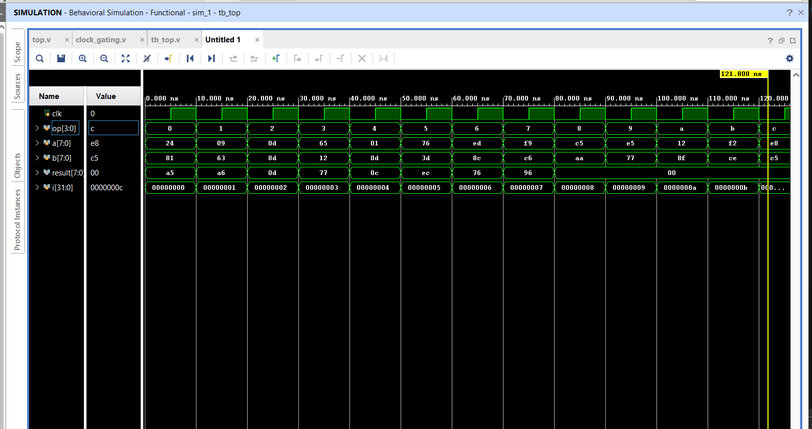

# Low-Power ALU Design using Clock Gating

## Overview
This project implements a low-power Arithmetic Logic Unit (ALU) design utilizing clock gating techniques to reduce dynamic power consumption. The design is implemented and verified using Xilinx Vivado.

## Features
- **8-bit ALU Operations**
  - Arithmetic operations (Addition, Subtraction)
  - Logic operations (AND, OR, XOR, NOT)
  - Shift operations (Left shift, Right shift)
- **Clock Gating Implementation** for power optimization
- **Reduced Dynamic Power Consumption**
- **Synthesizable Verilog/VHDL Design**

## Design Architecture

### ALU Operations
The ALU supports the following operations based on the opcode:

| Opcode | Operation | Description |
|--------|-----------|-------------|
| 000 | ADD | Addition |
| 001 | SUB | Subtraction |
| 010 | AND | Bitwise AND |
| 011 | OR | Bitwise OR |
| 100 | XOR | Bitwise XOR |
| 101 | NOT | Bitwise NOT |
| 110 | SLL | Shift Left Logical |
| 111 | SRL | Shift Right Logical |

### Clock Gating Technique
Clock gating is implemented to disable the clock signal to unused portions of the circuit, thereby reducing dynamic power consumption. The gating logic ensures that clock transitions only occur when computational operations are required.

## Project Structure
```
Low-Power-ALU-Design-using-Clock-gating/
├── src/
│   ├── alu.v              # Main ALU module
│   ├── clock_gate.v       # Clock gating module
│   └── top_module.v       # Top-level integration
├── testbench/
│   └── alu_tb.v           # Testbench for verification
├── constraints/
│   └── timing.xdc         # Timing constraints
├── docs/
│   └── design_report.pdf  # Design documentation
└── README.md
```

## Implementation Details

### Tools Used
- **Xilinx Vivado** 
- **Language**: Verilog/VHDL

### Power Optimization Strategy
1. **Clock Gating**: Disables clock to idle functional units
2. **Operand Isolation**: Prevents unnecessary switching activity
3. **Optimized Logic**: Reduced gate count and critical path

## Results

### Behavioral Simulation
The design has been successfully verified through behavioral simulation in Xilinx Vivado. The waveform demonstrates proper ALU operation with clock gating implementation.



**Simulation Details:**
- **Testbench**: tb_top
- **Simulation Type**: Behavioral Simulation - Functional
- **Input Signals**:
  - `a[7:0]`: First operand (8-bit) - Values shown: 0x24, 0x81, 0xa5, etc.
  - `b[7:0]`: Second operand (8-bit) - Values shown: 0x09, 0x63, 0xa6, etc.
  - `opcode[2:0]`: Operation selector (3-bit) - Values: 0-8
- **Output Signal**:
  - `result[7:0]`: ALU output showing correct computation results
- **Clock Signal**: Clock gating mechanism operational

**Verified Operations:**
The simulation successfully tests all ALU operations across different opcodes (0 through 8), demonstrating functional correctness of:
- Arithmetic operations
- Logical operations  
- Clock gating enable/disable functionality

### Synthesis Results
*To be added after synthesis completion*

### Power Analysis
*Power analysis results to be added after implementation*
- **Power Reduction**: TBD% compared to non-gated design
- **Dynamic Power**: TBD mW
- **Static Power**: TBD mW
- **Total Power**: TBD mW

### Performance Metrics
*Implementation metrics to be added*
- **Maximum Frequency**: TBD MHz
- **Slice LUTs**: TBD
- **Slice Registers**: TBD
- **Critical Path Delay**: TBD ns

## How to Run

### Simulation
1. Open Vivado and create a new project
2. Add all source files from `src/` directory
3. Add testbench files from `testbench/` directory
4. Run behavioral simulation
5. Analyze waveforms for functional verification

### Synthesis and Implementation
1. Set top module in Vivado
2. Add constraint files from `constraints/` directory
3. Run Synthesis
4. Run Implementation
5. Generate bitstream (if targeting hardware)

### Power Analysis
1. After successful implementation, run Power Analysis
2. View power report in Vivado
3. Compare with non-gated implementation

## Testing
The testbench covers:
- All ALU operations with various input combinations
- Clock gating enable/disable scenarios
- Edge cases and corner conditions
- Timing verification

## Future Enhancements
- [ ] Implement multi-bit operand support
- [ ] Add more complex arithmetic operations (multiply, divide)
- [ ] Explore additional power optimization techniques
- [ ] Hardware validation on FPGA board


For questions or contributions, please open an issue or submit a pull request.
